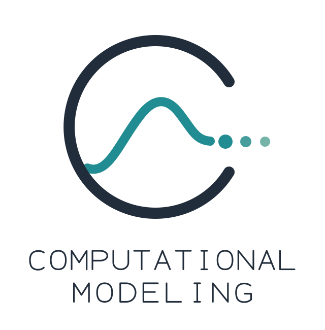
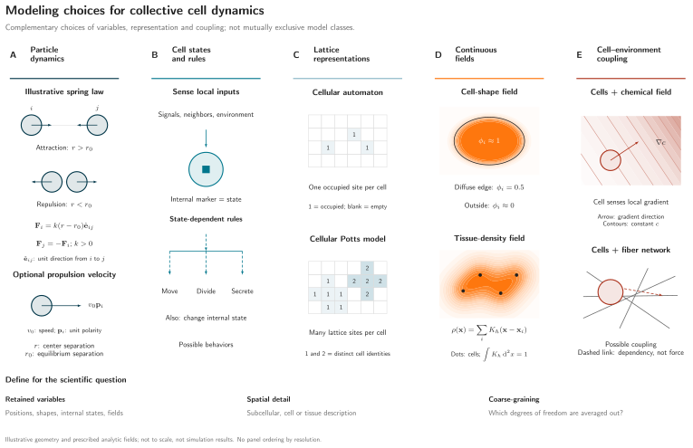

<p align="center">
  
</p>

# Computational Modeling Skills

**Computational Modeling Skills** is a collection of skills for scientific workflows used frequently and repeatedly in biophysics theoretical modeling. These skills aid in critically brainstorming and reviewing models to test hypotheses, doing linear stability analysis, writing structured Jupyter notebooks, making publication-quality plots, designing scientifically accurate concept diagrams and schematics, documenting code and models during model development, and running large simulation jobs in HPC.

My goal for making these skills is **not** to replace the scientist but only to aid them. If you are new to research then please use this skill to learn the process instead of bypassing the rigorous scientific training and thought. The main purpose is to automate repetitive workflows so that researchers can engage in what they are supposed to do: generating hypotheses and finding smart ways to test them. The point of this structured workflow is not to increase productivity, but to make computational research reproducible, reviewable, tractable, and more structured.

| Skill | Scope |
| --- | --- |
| [computational-modeling](skills/computational-modeling/SKILL.md) | Develop, test, and review scientific models for hypothesis testing, numerical verification, and physical validation |
| [model-documentation](skills/model-documentation/SKILL.md) | Write and audit model documents explaining physical assumptions, equations, and numerical methods |
| [scientific-notebook](skills/scientific-notebook/SKILL.md) | Create, maintain, execute, and review Jupyter notebooks for scientific research |
| [linear-stability-analysis](skills/linear-stability-analysis/SKILL.md) | Derive, compute, plot, and report linear stability of stationary states in 1D or 2D continuum systems |
| [data-visualization](skills/data-visualization/SKILL.md) | Create and refine publication-quality quantitative plots from completed scientific data, including notebook figures |
| [schematic-designer](skills/schematic-designer/SKILL.md) | Design scientifically faithful figures and schematics with editable sources, PDF, and outlined SVG |
| [paper-reproduce](skills/paper-reproduce/SKILL.md) | Reproduce, assess, or apply a paper’s computational model, method, claims, or results |
| [lets-be-clear](skills/lets-be-clear/SKILL.md) | Restate a request and confirm shared understanding before acting |
| [slurm](skills/slurm/SKILL.md) | Prepare, submit, inspect, and cancel one CPU batch job with native Slurm |

Use each skill on its own, or combine them when the task needs a handoff—for example, from model development to a notebook, analysis, figures, and documentation.

**Schematic designer example**



Original illustration by the collection maintainer ([MIT](LICENSE)); conceptual, not simulation output. [Editable source and context](skills/schematic-designer/assets/examples/matplotlib/collective-cell-model-classes/README.md).

**Paper reproduction decisions**


Choose one objective and one depth for each target; the depths are alternatives. [Workflow and editable diagram](skills/paper-reproduce/README.md).

## Install

Add this user-hosted marketplace, then install the plugin in your chosen client.

**Claude Code**

```bash
claude plugin marketplace add surajinacademia/theoretical-biophysics-modeling-skills
claude plugin install computational-modeling-skills@computational-modeling
```

**Codex**

```bash
codex plugin marketplace add surajinacademia/theoretical-biophysics-modeling-skills
codex plugin add computational-modeling-skills@computational-modeling
```

Choose plugin installation or direct skill installation to avoid duplicate discovery. Python, TeX, and Slurm are external tools required only by workflows that use them.

Original material uses the [MIT license](LICENSE). Attributed examples and fonts retain their own terms, including ShareAlike and the VIGIL example’s noncommercial restriction; see [third-party notices](THIRD_PARTY_NOTICES.md).
