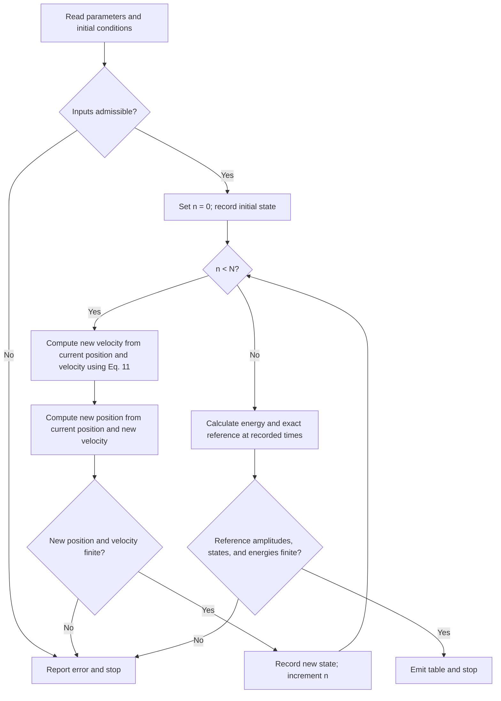

# Overdamped Harmonic Oscillator

Implementation: [model.py](model.py)

Model version control name:

## 1. Purpose, Questions, and Hypothesis

- **Model:** one-dimensional spring–mass motion with viscous damping and retained inertia.
- **Regime:** overdamped, with two real decay rates.
- **Question:** do linear elasticity and velocity-proportional damping explain measured relaxation?
- **Prediction:** release from rest at positive displacement gives a monotonic return with two exponential contributions.
- **Contradicting evidence:** reproducible oscillations or amplitude-dependent relaxation rates under the same conditions.
- **Status:** illustrative implementation and parameters; no experimental data. The exact solution supports numerical verification only.

## 2. Mechanism and Assumptions

- **Geometry:** a mass moves along one fixed axis. A spring and damper connect it to fixed supports; equilibrium is the origin.
- **Included:** inertia, a linear restoring force, and instantaneous velocity-proportional damping.
- **Excluded:** rotation, transverse motion, internal deformation, external driving, and random forces.
- **Linear elasticity:** approximates the response near stable equilibrium; a real spring’s linear range must be established. See [Fitzpatrick, Eqs. 2.1–2.3](https://farside.ph.utexas.edu/teaching/315/Waves/node12.html).
- **Viscous damping:** a phenomenological assumption excluding dry friction, nonlinear drag, and memory. See [Fitzpatrick’s discussion after Eq. 2.3](https://farside.ph.utexas.edu/teaching/315/Waves/node12.html).
- **Constant coefficients:** isolate a time-independent response; exclude aging and state-dependent material properties.
- **Free relaxation:** a deterministic modeling choice; sustained forcing and thermal fluctuations lie outside its scope.
- **Domain:** continuous nonnegative time and real-valued displacement. Positive velocity increases displacement; there are no spatial fields or bond graphs.
- **Units:** International System of Units (SI); identify dimensionless quantities where introduced.
- **Overdamped** describes the damping regime; inertia remains in the equations.

## 3. Notation, Parameters, Values, and Evidence

- The table registers the coordinates, state, physical parameters, initial conditions, numerical controls, and force definitions.
- Values are illustrative implementation defaults, not fitted or literature measurements.
- Ranges specify admissibility, not a parameter sweep or an experimentally established range.
- A dot denotes differentiation with respect to time.
- A newton is $\mathrm{N}=\mathrm{kg\,m\,s^{-2}}$.
- The numerical defaults come from the companion implementation identified in Section 7.1; they have no literature citation.
- Citations for force laws support their form, not the illustrative parameter values.

| Quantity [notation] | Units | Values or range | Meaning or rationale for inclusion | Citation source |
| --- | --- | --- | --- | --- |
| Time [$t$] | $\mathrm{s}$ | $t\geq0$ | Time since release; sampled times must be finite. | |
| Displacement [$x(t)$] | $\mathrm{m}$ | Real-valued state; initial value in Section 4.3 | Signed position relative to equilibrium; computed values must be finite. | |
| Velocity [$v(t)$] | $\mathrm{m\,s^{-1}}$ | $v=\mathrm{d}x/\mathrm{d}t$; initial value in Section 4.3 | Rate of displacement; positive velocity increases displacement. Computed values must be finite. | |
| Mass [$m$] | $\mathrm{kg}$ | $1$; $m>0$ | Moving mass that sets the inertial response; illustrative default. | |
| Spring stiffness [$k$] | $\mathrm{N\,m^{-1}}$ | $4$; $k>0$ | Strength of the linear restoring force; illustrative default. The physical linear range is not established here. | |
| Viscous damping coefficient [$\gamma$] | $\mathrm{kg\,s^{-1}}$ | $5$; $\gamma>0$ | Strength of velocity-proportional damping; illustrative default chosen for simple decay rates. | |
| Initial displacement [$x_0$] | $\mathrm{m}$ | $0.01$; finite real input | Illustrative positive release displacement. | |
| Initial velocity [$v_0$] | $\mathrm{m\,s^{-1}}$ | $0$; finite real input | Illustrative release from rest. | |
| Spring force [$F_{\mathrm{s}}$] | $\mathrm{N}$ | $F_{\mathrm{s}}=-kx$ | Restores equilibrium under the linear-force assumption in Section 2. | [Fitzpatrick, Section 2.1](https://farside.ph.utexas.edu/teaching/315/Waves/node12.html) |
| Damping force [$F_{\mathrm{d}}$] | $\mathrm{N}$ | $F_{\mathrm{d}}=-\gamma v$ | Opposes velocity under the viscous-damping assumption in Section 2. | [Fitzpatrick, Section 2.1](https://farside.ph.utexas.edu/teaching/315/Waves/node12.html) |
| Timestep [$h$] | $\mathrm{s}$ | $0.01$; finite $h>0$ | Numerical time resolution; representability restrictions and rationale in Section 6.2. | |
| Number of steps [$N$] | Dimensionless | $500$; nonnegative integer | Sets duration together with the timestep; final time must be finite. Memory limitation in Section 7.1. | |

- The mathematical overdamped regime requires the coupled condition $\gamma^2>4mk$ in addition to positive mechanical parameters.
- The implementation further requires finite inputs, representable intermediate values and distinct, finite, negative roots; Section 6.2 details these narrower computational restrictions.
- Neither mathematical admissibility nor code acceptance establishes experimental applicability.
- Symbols for derived decay rates, amplitudes, observables, and sampled states are defined before their first local use.
- Define the dimensionless damping ratio $\zeta$ by

$$
\zeta=\frac{\gamma}{2\sqrt{mk}}.
$$

- Overdamping requires $\zeta>1$.
- The defaults give $\zeta=1.25$, placing this example strictly above critical damping.
- This classification follows the characteristic roots of the equation of motion, as developed in [Idema, Section 8.2](https://phys.libretexts.org/Bookshelves/University_Physics/Mechanics_and_Relativity_%28Idema%29/08%3A_Oscillations/8.02%3A_Damped_Harmonic_Oscillator).
- The chosen values are illustrative; that source does not supply these defaults.

## 4. Governing Model

### 4.1. Model Equations

- **Restoring force and dissipation.** The spring opposes displacement, while the damper opposes velocity:

$$
F_{\mathrm{s}}=-kx,\qquad F_{\mathrm{d}}=-\gamma v. \tag{1}
$$

- The signs express two different tendencies: elasticity restores the equilibrium position, and damping resists motion in either direction.
- Applying Newton's second law gives

$$
m\ddot{x}+\gamma\dot{x}+kx=0. \tag{2}
$$

- Each term has units of force.
- Equation (2) retains the acceleration of the mass as well as the two forces in Eq. (1).
- The implemented first-order form is

$$
\dot{x}=v,\qquad m\dot{v}=-\gamma v-kx. \tag{3}
$$

- **Two decay times.** To solve Eq. (2), seek exponential contributions with characteristic rate $\lambda$, measured in $\mathrm{s^{-1}}$.
- Substitution gives $m\lambda^2+\gamma\lambda+k=0$.
- Denote the slower and faster roots by $\lambda_{\mathrm{s}}$ and $\lambda_{\mathrm{f}}$, respectively:

$$
\lambda_{\mathrm{s}}=\frac{-\gamma+\sqrt{\gamma^2-4mk}}{2m},\qquad
\lambda_{\mathrm{f}}=\frac{-\gamma-\sqrt{\gamma^2-4mk}}{2m}. \tag{4}
$$

- For the chosen regime, $\lambda_{\mathrm{f}}<\lambda_{\mathrm{s}}<0$.
- Define the positive decay times, in seconds, by $\tau_{\mathrm{s}}=-1/\lambda_{\mathrm{s}}$ and $\tau_{\mathrm{f}}=-1/\lambda_{\mathrm{f}}$.
- The defaults give $\lambda_{\mathrm{s}}=-1\,\mathrm{s^{-1}}$ and $\lambda_{\mathrm{f}}=-4\,\mathrm{s^{-1}}$, hence decay times of $1\,\mathrm{s}$ and $0.25\,\mathrm{s}$.
- These values are direct substitutions into Eq. (4).
- Let $A_{\mathrm{s}}$ and $A_{\mathrm{f}}$ be displacement amplitudes, in metres, fixed by the initial conditions.
- Solving the two initial-value equations yields

$$
A_{\mathrm{s}}=\frac{v_0-\lambda_{\mathrm{f}}x_0}{\lambda_{\mathrm{s}}-\lambda_{\mathrm{f}}},\qquad
A_{\mathrm{f}}=\frac{\lambda_{\mathrm{s}}x_0-v_0}{\lambda_{\mathrm{s}}-\lambda_{\mathrm{f}}}. \tag{5}
$$

- The exact position and velocity, denoted $x_{\mathrm{exact}}$ and $v_{\mathrm{exact}}$, are therefore

$$
x_{\mathrm{exact}}(t)=A_{\mathrm{s}}e^{\lambda_{\mathrm{s}}t}+A_{\mathrm{f}}e^{\lambda_{\mathrm{f}}t},\qquad
v_{\mathrm{exact}}(t)=\lambda_{\mathrm{s}}A_{\mathrm{s}}e^{\lambda_{\mathrm{s}}t}+\lambda_{\mathrm{f}}A_{\mathrm{f}}e^{\lambda_{\mathrm{f}}t}. \tag{6}
$$

- The slow contribution controls late relaxation when its amplitude is nonzero.
- A negative amplitude is allowed: the two contributions must jointly satisfy the initial velocity.
- For arbitrary initial velocity, overdamping does not guarantee that displacement is monotonic; the release-from-rest prediction in Section 1 uses the specific initial conditions below.
- **Relation to negligible inertia.** Define the dimensionless ratio $\epsilon=mk/\gamma^2$.
- When $\epsilon\ll1$ and the fast transient has passed, Eq. (4) gives a slow rate approaching $-k/\gamma$.
- The reduced equation $\gamma\dot{x}=-kx$ describes that approximation.
- Here $\epsilon=0.16$; the reference implementation solves Eq. (3) and makes no negligible-inertia approximation.

### 4.2. Mechanistic Steps

- At every instant, the spring and damper act simultaneously on the mass.
- The spring force draws the mass toward equilibrium, while the damping force opposes its current velocity.
- Their sum determines acceleration through Eq. (3); velocity determines the continuous change in displacement.
- As displacement and velocity change, both forces change with them.
- This continuous mechanism retains inertia and the two decay times in Eq. (4).
- Section 6.3 gives the numerical sequence used to approximate this coupled evolution.

### 4.3. Initial and Boundary Conditions

- We prescribe release from rest:

$$
x(0)=x_0=0.01\,\mathrm{m},\qquad v(0)=v_0=0\,\mathrm{m\,s^{-1}}. \tag{7}
$$

- Both values are illustrative initial conditions.
- No preliminary relaxation is performed.
- The prescribed state is recorded at time zero, before the first numerical step.
- With these conditions, Eq. (5) gives $A_{\mathrm{s}}=4x_0/3$ and $A_{\mathrm{f}}=-x_0/3$ for the default mechanical parameters.
- This is an initial-value problem for ordinary differential equations.
- There is no spatial boundary at which a boundary condition must be imposed: the coordinate is unbounded.
- Motion is neither wrapped nor reflected, and the spring's fixed support is already represented by the force law.

## 5. Observables and Outputs

- The primary observable is displacement as a function of time.
- For nonzero $x_0$, define the dimensionless displacement $X(t)=x(t)/x_0$.
- Under the prescribed release, the model predicts that $X$ decreases from one toward zero.
- A late-time exponential fit can estimate the slow decay time, provided the fitting interval follows the fast transient and the slow amplitude is nonzero.
- Define the mechanical energy $E$, in joules ($\mathrm{J}=\mathrm{kg\,m^2\,s^{-2}}$), as the sum of kinetic and spring energies:

$$
E(t)=\frac12 m v(t)^2+\frac12 k x(t)^2. \tag{8}
$$

- Differentiating Eq. (8) and substituting Eq. (3) gives

$$
\frac{\mathrm{d}E}{\mathrm{d}t}=mv\dot{v}+kx\dot{x}=-\gamma v^2\leq0. \tag{9}
$$

- Thus dissipation decreases total mechanical energy even though energy may pass between the spring and the moving mass.
- The instantaneous energy loss is zero when velocity is zero.
- Displacement, velocity, and energy are recorded at every numerical step; no ensemble averaging is needed for this deterministic example.
- An experimental test would compare independently measured displacement with Eq. (6), accounting for measurement uncertainty and the validity of the force assumptions.
- Numerical agreement with Eq. (6) checks the calculation.
- It cannot establish that a particular material obeys linear elasticity or linear viscous damping.
- Calibration uses observed displacement to estimate identifiable parameter combinations.
- Validation instead tests predictions of the calibrated model against independent observations that were not used for estimation.
- Dividing Eq. (2) by $m$ gives $\ddot{x}+(\gamma/m)\dot{x}+(k/m)x=0$, so a common positive rescaling of $m$, $\gamma$, and $k$ leaves the displacement trajectory unchanged.
- Displacement data can therefore structurally identify at most $\gamma/m$ and $k/m$, not all three absolute parameters; separating them requires an independent measurement of at least one parameter or equivalent force-scale information.

## 6. Method

### 6.1. Methodology and Rationale

- We integrate the coupled position and velocity equations with backward Euler, evaluating both rates at the new time.
- For this linear system the implicit equations can be solved algebraically, so no iterative solver is needed.
- The method has stable decaying modes for positive timesteps and dissipates the discrete mechanical energy.
- These properties suit a relaxation problem; timestep refinement is still required for accuracy.
- Equation (6) supplies an independent analytic reference.
- The choice of backward Euler is supported by the standard stability analysis in [Driscoll and Braun, Section 11.3](https://fncbook.com/absstab-diffusion/).

### 6.2. Numerical Formulation

- Using the timestep $h$ and step count $N$ registered in Section 3, let $n$ be a dimensionless integer step index from zero to $N$.
- The sampled time $t_n$, numerical displacement $x_n$, and numerical velocity $v_n$ retain the units of $t$, $x$, and $v$, respectively.
- Define $t_n=nh$, $x_n\approx x(t_n)$, and $v_n\approx v(t_n)$.
- The final time $T$, in seconds, is $T=Nh$.
- The reference calculation uses $h=0.01\,\mathrm{s}$ and $N=500$, so $T=5\,\mathrm{s}$.
- The timestep is one twenty-fifth of the fast decay time; this is a chosen resolution, not a stability limit.
- Applying backward Euler to Eq. (3) gives

$$
\frac{x_{n+1}-x_n}{h}=v_{n+1},\qquad
m\frac{v_{n+1}-v_n}{h}=-\gamma v_{n+1}-kx_{n+1}. \tag{10}
$$

- Substitute $x_{n+1}=x_n+h v_{n+1}$ into the velocity equation and solve for the new velocity:

$$
v_{n+1}=\frac{m v_n-hkx_n}{m+\gamma h+kh^2},\qquad
x_{n+1}=x_n+h v_{n+1}. \tag{11}
$$

- All terms in the denominator have units of mass, and the denominator is positive for the admissible parameters.
- The first expression reads the old position and velocity; the second reads the old position and the newly computed velocity.
- This order implements a coupled implicit step, not a forward Euler step with sequential overwriting.
- The implementation uses double-precision floating-point arithmetic.
- There is no mesh, random sampling, force cutoff, clipping, nonlinear iteration, or tolerance-based stopping rule.
- Inputs must be finite, mechanical parameters and the timestep positive, the step count a nonnegative integer, and the discriminant in Eq. (4) strictly positive and finite.
- Computed roots must be finite, distinct, and negative; the final time and backward Euler denominator must also be finite.
- The code rejects nonfinite numerical states, analytic amplitudes or states, and reported energies.
- These computational restrictions are narrower than the mathematical overdamped regime: positive finite inputs alone do not guarantee representable intermediate values.
- Any such failure stops the command before a table is emitted.

### 6.3. Algorithm and Flowchart

- The algorithm advances Eq. (11) exactly $N$ times and records the initial state plus every updated state.
- In the steps below, an arrow means assignment; its right-hand side is evaluated before the left-hand side changes.

1. Read $m$, $\gamma$, $k$, $x_0$, $v_0$, $h$, and $N$; check the admissibility conditions in Section 6.2.
2. Set $n\leftarrow0$, $x_n\leftarrow x_0$, and $v_n\leftarrow v_0$. Record $(t_0,x_0,v_0)$.
3. While $n<N$, compute $v_{n+1}\leftarrow(mv_n-hkx_n)/(m+\gamma h+kh^2)$.
4. Compute $x_{n+1}\leftarrow x_n+h v_{n+1}$ and check that both new values are finite.
5. Record $(t_{n+1},x_{n+1},v_{n+1})$, set $n\leftarrow n+1$, and return to step 3.
6. For every recorded time, calculate $E$ from Eq. (8) and the exact position and velocity from Eq. (6), checking the amplitudes and outputs for finite values. On failure, report an error and stop without emitting a table. Otherwise, emit the complete recorded table and stop.

- The flowchart shows the same update order.
- In its labels, current denotes the state at index $n$, and new denotes the state at index $n+1$.
- The analytic solution is evaluated after integration and never used to advance the numerical state.

### 6.4. Verification, Validation, and Required Scientific Tests

- For a characteristic mode with rate $\lambda<0$, define the dimensionless numerical amplification factor $g$, the multiplier per step.
- Equation (10) gives $g=(1-h\lambda)^{-1}$, so $0<g<1$ for every positive $h$.
- This establishes stability of the modes, but large timesteps still misrepresent their decay rates.
- Backward Euler has first-order global accuracy over a fixed finite time interval for this smooth system.
- The method also preserves energy decay.
- Define the displacement increment $\Delta x_n=x_{n+1}-x_n$, in metres, and the velocity increment $\Delta v_n=v_{n+1}-v_n$, in metres per second.
- Let $E_n$, in joules, denote Eq. (8) evaluated at $(x_n,v_n)$.
- Multiplying the velocity equation in Eq. (10) by $h v_{n+1}$ and using $\Delta x_n=h v_{n+1}$ yields

$$
E_{n+1}-E_n=-h\gamma v_{n+1}^2-\frac12m(\Delta v_n)^2-\frac12k(\Delta x_n)^2\leq0. \tag{12}
$$

- The last two terms are additional dissipation from the discretization.
- Energy decay alone therefore does not establish trajectory accuracy.
- Define the maximum displacement error $e_x(h)$, in metres, and velocity error $e_v(h)$, in metres per second, on the sampled interval by

$$
e_x(h)=\max_{0\leq n\leq N}|x_n-x_{\mathrm{exact}}(t_n)|,\qquad
e_v(h)=\max_{0\leq n\leq N}|v_n-v_{\mathrm{exact}}(t_n)|. \tag{13}
$$

- Check Eqs. (10) and (12) to floating-point tolerance, then compare with Eq. (6) at $h$, $h/2$, and $h/4$ while keeping $T$ fixed.
- First-order convergence predicts that each maximum error decreases by approximately a factor of two per refinement once the calculation is in the asymptotic regime.
- Also check the zero initial state and rejection of critical, underdamped, and invalid inputs.
- These are numerical verification procedures, not reported experimental results.
- Independent displacement measurements, the force assumptions, and the separation of calibration from validation define the physical tests in Section 5.
- No such experimental evidence is supplied here, and this document does not report execution of the proposed numerical checks.
- **Sensitivity.** Assess how uncertainty in the identifiable ratios $\gamma/m$ and $k/m$, and in the initial conditions, affects the displacement trajectory and inferred decay times.
- Use independently supported uncertainty ranges when available, remain within the overdamped regime, and compare the resulting differences with measurement uncertainty.
- Repeat the numerical comparison under timestep refinement so that discretization error can be distinguished from physical-parameter sensitivity.
- No parameter-uncertainty ranges or measurement errors are supplied here; quantitative acceptance criteria remain unresolved until those inputs are available.
- These are proposed checks, not executed sensitivity results.
- The analytic calculation avoids cancellation in the slow root by using the equivalent expression $\lambda_{\mathrm{s}}=k/(m\lambda_{\mathrm{f}})$.
- Very close to critical damping, the two amplitudes in Eq. (5) can still suffer cancellation.
- This small implementation does not provide a critical-limit formula or an exhaustive floating-point error analysis; its default parameters have well-separated roots.

## 7. Model Record and Implementation History

### 7.1. Scripts and Version History

- The companion [model.py](model.py) is original reference code supplied with this illustrative document.
- It requires Python 3.9 or newer and only the standard library.
- Importing it performs no simulation.
- Direct execution calculates the trajectory and writes comma-separated values to standard output; it creates no output directories or files and makes no network requests.
- Prepared against repository revision `f1c111c3e43d7f44b006ee7298f2a064fd95cdc6` in a dirty working tree, with this example source newly added and untracked.
- Exact source: `skills/model-documentation/examples/overdamped-harmonic-oscillator/model.py`; SHA-256: `2abba845ac82f0a02f2f682a181028cb436625d33f8226d40295d0b5591ff807`.
- The hash identifies the implementation described here; update this record when that source changes.
- The equation-to-code mapping in the companion source is:
- `decay_rates` evaluates the characteristic roots in Eq. (4) for the exact solution and parameter checks.
- `exact_state` evaluates Eqs. (5)–(6), supplying `exact_position_m` and `exact_velocity_m_per_s`.
- `integrate` applies the backward Euler update in Eq. (11), supplying `time_s`, `position_m`, and `velocity_m_per_s`.
- `main` evaluates the energy in Eq. (8) and emits `energy_J` alongside the trajectory and exact reference.
- Run the default example from its directory with `python3 model.py`.
- The command-line options `--mass`, `--drag`, and `--stiffness` map to $m$, $\gamma$, and $k$; `--x0`, `--v0`, `--dt`, and `--steps` map to $x_0$, $v_0$, $h$, and $N$.
- The table contains $N+1$ rows plus the header, including time zero.
- Exact-reference columns are calculated from the same mechanical parameters and initial conditions.
- No plot, sweep, or saved simulation result is bundled.
- The command retains both the trajectory and the complete output table in memory, so storage grows linearly with $N$.
- There is no enforced memory-based step limit; the example is intended for small verification runs, and a large requested step count may exhaust available memory before output is emitted.

### 7.2. Method Decisions and Changes

- The implemented choices and their supporting records are:
- **Retain inertia within the overdamped regime.** Equation (3) and `integrate` retain both decay times and distinguish overdamping from the negligible-inertia approximation.
- **Use backward Euler with an algebraic solve.** Equation (11) keeps the timestep derivation explicit; the discrete energy identity in Eq. (12) establishes energy decay.
- **Retain an analytic reference.** `exact_state` provides a solution independent of the stepping method against which to check numerical errors.
- No model release name or semantic version is recorded for this illustrative implementation, so the header field is blank.
- No earlier method trials or rejected implementations are claimed.
- Verification procedures remain in Section 6.4.
- Run-specific commands and measured errors are reported in the completion conversation, or linked here only if an existing verification record is available; no separate record is created for this document.
- Application to a specific experiment would require evidence for the assumed forces and calibrated parameter values.

### 7.3. References

1. Richard Fitzpatrick, [Damped Harmonic Oscillation](https://farside.ph.utexas.edu/teaching/315/Waves/node12.html), *Oscillations and Waves*, Section 2.1. Source for the mass-spring-damper formulation and the distinction between elastic linearization and phenomenological damping. His mass-normalized damping notation differs from the coefficient $\gamma$ used here.
2. Timon Idema, [Damped Harmonic Oscillator](https://phys.libretexts.org/Bookshelves/University_Physics/Mechanics_and_Relativity_%28Idema%29/08%3A_Oscillations/8.02%3A_Damped_Harmonic_Oscillator), *Mechanics and Relativity*, Section 8.2. Source for classification by characteristic roots and damping ratio.
3. Tobin A. Driscoll and Richard J. Braun, [Absolute Stability](https://fncbook.com/absstab-diffusion/), *Fundamentals of Numerical Computation*, Section 11.3. Source for the amplification-factor interpretation of backward Euler stability. Equations (11)-(13) specialize the numerical reasoning to the present system.
