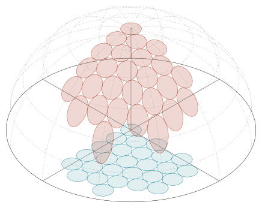

# Projection of circles onto a spherical surface

Current Minimalist adaptation of the archived construction. [Editable source](source.tex); [PDF](figures/figure.pdf); [outlined SVG](figures/figure.svg).

Original layered dome design, recolored with the Minimalist palette. The floor circles use palette teal (5), the projected circles use rust (1), and the original 0.25 fill opacity, dotted hemisphere, layer order, scale, strokes, circle placement and projection equations are retained. The original has translucent surfaces, not a ball-lighting gradient; no gradient is invented.

## Design lesson

- **Use when:** A reader needs to compare a planar footprint with its image on
  a curved surface.
- **Choice and benefit:** The floor and elevated circles share horizontal coordinates. Their original translucent fills and layer order reveal depth and overlap while the dotted hemisphere locates the projected surfaces. Preserve those depth cues when changing the palette; replacing them with wireframes changes the design.
- **Transfer:** Separate the reference surface, source objects, and transformed
  objects into drawing layers. Compute corresponding geometry from shared inputs
  so a restyle cannot accidentally change the mapping.
- **Check when adapting:** This dense view does not individually label circle
  correspondences. If one-to-one matching is the question, highlight a selected
  pair or add identifiers. Verify new footprints lie within the projection's
  domain; the appearance of the projected shapes does not establish area
  preservation.

## Rebuild

From the skill root, run `python3 scripts/build_example.py tikz-dome --output-dir <path>`. The builder generates the shared Minimalist support style in its work directory and compiles this adapted source through the declared-input LuaLaTeX renderer. It does not execute the archived source or install dependencies.

See [ATTRIBUTION.md](ATTRIBUTION.md) for source identity, license, notices, and changes.

## Preservation rule

The owner requested the original design with palette changes only. Its shading, translucency, layout and stroke hierarchy therefore take precedence over generic flat-fill or quiet-context defaults. CMU Sans text, real Computer Modern math and native Latex arrowheads are supplied by the shared runtime. Do not flatten these depth cues in a later cleanup.
