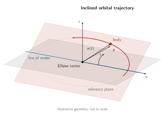

# Inclined orbital trajectory

Current Minimalist adaptation of the archived construction. [Editable source](source.tex); [PDF](figures/figure.pdf); [outlined SVG](figures/figure.svg).

The archived illustrative geometry and inclination constants are retained. The incorrect “focus” label at the ellipse center is corrected to “Ellipse center”; no point was moved. This construction is illustrative, not an exact Keplerian orbit.

## Design lesson

- **Use when:** A path's relation to two planes, their intersection, and a
  position vector matters more than a photorealistic scene.
- **Choice and benefit:** Pale plane fills retain spatial context while the
  intersection line, body marker, and position vector remain distinct. A solid
  directional segment draws attention within the dashed full ellipse; nearby
  labels identify the geometry without a separate legend.
- **Transfer:** Build related planes, trajectories, and projected points from
  one coordinate construction. Use opacity to expose overlapping surfaces and
  place explanatory notes outside them, keeping quantitative geometry unchanged.
- **Check when adapting:** The dashed ellipse supplies full-path context here,
  not a universal hidden-line or uncertainty convention. This example is
  illustrative: neither its curved inclination annotation nor its ellipse
  should be copied as a measured angle or a validated Keplerian orbit. Calculate
  those quantities explicitly when the new figure requires them.

## Rebuild

From the skill root, run `python3 scripts/build_example.py tikz-orbital-elements-3d-trajectory --output-dir <path>`. The builder generates the shared Minimalist support style in its work directory and compiles this adapted source through the declared-input LuaLaTeX renderer. It does not execute the archived source or install dependencies.

See [ATTRIBUTION.md](ATTRIBUTION.md) for source identity, license, notices, and changes.

Central scientific labels use the shared body role (8 pt); only supporting notes use the smaller type role.

## Visual design revision

The orbital plane, full path, highlighted segment, body marker, and body label consistently use palette color 1, with context opacity distinguishing supporting geometry. The position vector and its label use palette color 6; the line of nodes and its label retain palette color 5. The inclination is a neutral angular measure rather than sharing the body color. Plane borders and the projection guide now use context strokes and opacity. Scientific coordinates, vectors, angles, and 8 pt central labels are unchanged.
