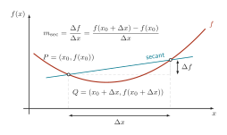

# Secant slope geometry

Current Minimalist adaptation of the archived construction. [Editable source](source.tex); [PDF](figures/figure.pdf); [outlined SVG](figures/figure.svg).

The parabola, P/Q coordinates, secant endpoints, difference construction, and slope equation are unchanged. Geometry retains its data coordinates; shared tokens apply only to label sizes, strokes, markers, and arrows.

## Design lesson

- **Use when:** An equation needs a geometric explanation of how its terms are
  constructed, rather than only a symbolic statement.
- **Choice and benefit:** The secant joins two marked points on the analytic
  curve. Dashed guides connect those points to the horizontal and vertical
  differences, while dimension arrows sit outside the main curve. The equation
  occupies open space above the construction, making its ratio available without
  obscuring the geometry.
- **Transfer:** Derive points, guides, and difference annotations from the same
  coordinates, then reserve distinct spaces for the equation and labels. Keep
  curve shape and sampling separate from these layout choices.
- **Check when adapting:** Recompute every dependent guide after changing the
  function or point positions. Preserve the displayed horizontal and vertical
  differences; a visually convenient triangle is not interchangeable with the
  one defined by the selected points.

## Rebuild

From the skill root, run `python3 scripts/build_example.py tikz-secant-regression-geometry --output-dir <path>`. The builder generates the shared Minimalist support style in its work directory and compiles this adapted source through the declared-input LuaLaTeX renderer. It does not execute the archived source or install dependencies.

See [ATTRIBUTION.md](ATTRIBUTION.md) for source identity, license, notices, and changes.

Central scientific labels use the shared body role (8 pt); only supporting notes use the smaller type role.

## Visual design revision

The analytic function and its direct label now share palette color 1; the secant and its label share palette color 5. Difference arrows are neutral measurements rather than two additional color categories. Construction guides use the shared context stroke and opacity, and dimension offsets use the shared spacing role. Central labels remain 8 pt; function values, endpoints, and differences are unchanged.
