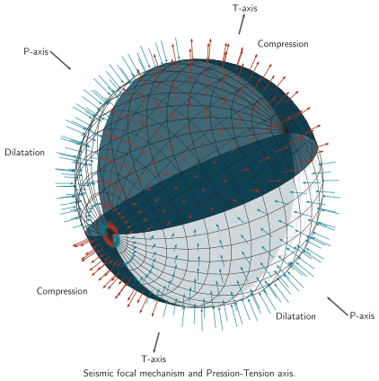

# Seismic focal mechanism in 3D view

Current Minimalist adaptation of the archived construction. [Editable source](source.tex); [PDF](figures/figure.pdf); [outlined SVG](figures/figure.svg).

The original facet fills, mesh strokes, drawing scale, label positions and 0.75 overall opacity are restored. Navy (6) replaces black quadrant fills; white and unfilled quadrants remain distinct. Rust (1) replaces red outward arrows, teal (5) replaces black inward arrows, and neutral ink serves the P/T axes. Every spherical coordinate, quadrant range, sample, vector endpoint and direction is retained, together with the source’s “Pression-Tension” wording.

## Design lesson

- **Use when:** Directional information distributed over a surface must remain
  visible alongside a small number of global axes and region labels.
- **Choice and benefit:** The original layered facet fills and opacity distinguish the intersecting spherical regions and their depth. Local arrows remain dense and directional; separate P/T arrows and surrounding labels explain the global construction. Keep the original region fills and overlap mechanism when recoloring, rather than reducing the sphere to a pale wireframe.
- **Transfer:** Give local vectors, reference geometry, and global annotations
  separate visual roles. Place repeated region names near the relevant parts
  of a projected surface rather than requiring continual legend lookup.
- **Check when adapting:** The retained mesh and vector sampling produce a dense
  view, especially near projected poles. Inspect terminal direction and overlap
  at the intended size; a second view may help a new figure. Do not delete
  vectors or change their lengths merely to reduce clutter without checking what
  scientific information they encode.

## Rebuild

From the skill root, run `python3 scripts/build_example.py tikz-seismic-focal-mechanism-in-3d-view --output-dir <path>`. The builder generates the shared Minimalist support style in its work directory and compiles this adapted source through the declared-input LuaLaTeX renderer. It does not execute the archived source or install dependencies.

See [ATTRIBUTION.md](ATTRIBUTION.md) for source identity, license, notices, and changes.

## Preservation rule

The owner requested the original design with palette changes only. Its shading, translucency, layout and stroke hierarchy therefore take precedence over generic flat-fill or quiet-context defaults. CMU Sans text, real Computer Modern math and native Latex arrowheads are supplied by the shared runtime. Do not flatten these depth cues in a later cleanup.
