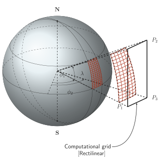

# Spherical and cartesian grids

Current Minimalist adaptation of the archived construction. [Editable source](source.tex); [PDF](figures/figure.pdf); [outlined SVG](figures/figure.svg).

The original ball-lighting gradient, drawing scale, stroke hierarchy and lower curved callout are restored. A pale tint of Minimalist light blue (4) supplies the ball color; rust (1) replaces red mesh lines and neutral ink replaces black. The unavailable surrounding-document caption is omitted, and the callout reads “Computational grid” with “[Rectilinear]” underneath. The established frozen-plane transform correction remains; projection formulas, supplied angles, mesh samples and labels retain their meanings.

## Design lesson

- **Use when:** A local mesh must be understood within a global coordinate
  construction, rather than presented as an isolated patch.
- **Choice and benefit:** The ball-lighting gradient makes the sphere read as a volume, while solid and dashed arcs locate visible and hidden geometry. Colored meshes and the dark rectilinear boundary retain their original contrast. Preserve this lighting and depth hierarchy rather than substituting a flat white disk.
- **Transfer:** Give the global scaffold and selected region different visual
  prominence, but derive both from the same coordinates. Keep labels outside
  dense mesh crossings and preserve each named plane's transform independently.
- **Check when adapting:** Dashed lines here serve both hidden arcs and
  construction rays; distinguish those roles further if a new figure could
  confuse them. The drawing alone does not quantify projection distortion or
  establish that a particular mesh is appropriate for a simulation.

## Rebuild

From the skill root, run `python3 scripts/build_example.py tikz-spherical-and-cartesian-grids --output-dir <path>`. The builder generates the shared Minimalist support style in its work directory and compiles this adapted source through the declared-input LuaLaTeX renderer. It does not execute the archived source or install dependencies.

See [ATTRIBUTION.md](ATTRIBUTION.md) for source identity, license, notices, and changes.

The working-plane transforms now freeze their trigonometric coefficients at definition time. The archived implementation stored mutable macros, causing separately named planes to reuse later coefficients and collapse the projected quadrilateral. This renderer correction restores the intended distinct projections without changing the projection formulas or supplied angles.

## Preservation rule

The owner requested the original design with palette changes only. Its shading, translucency, layout and stroke hierarchy therefore take precedence over generic flat-fill or quiet-context defaults. CMU Sans text, real Computer Modern math and native Latex arrowheads are supplied by the shared runtime. Do not flatten these depth cues in a later cleanup.
